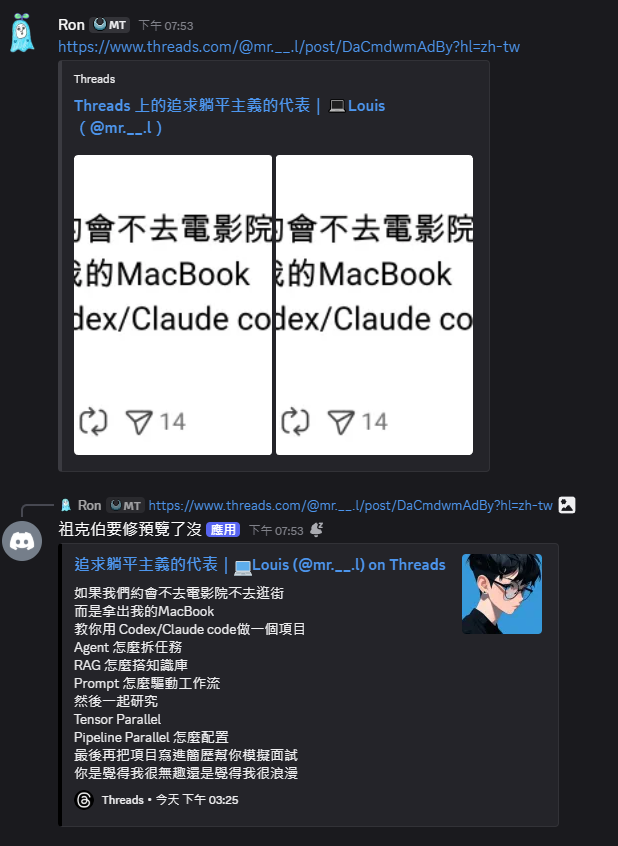
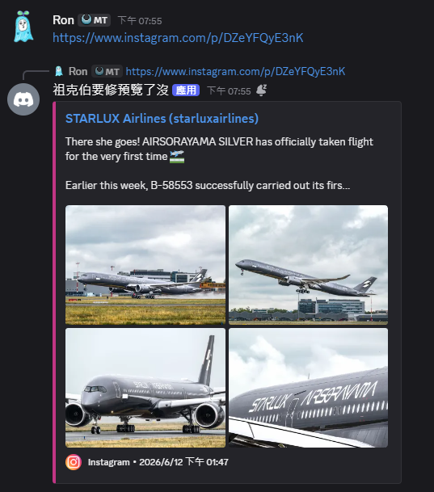

# Discord-threads-fix

Discord 預覽機器人，自動將頻道中分享的 Threads 和 Instagram 貼文連結嵌入成預覽卡片，支援單張圖片、輪播相簿、影片。

## 功能

- 自動偵測訊息中的 Threads 和 Instagram 連結
- 嵌入貼文的作者、標題、描述、圖片與發布時間
- 支援多圖輪播貼文
- 原始訊息被刪除時，自動刪除對應的 bot 嵌入卡片

## 截圖




## 安裝與設定

### 環境變數

複製 `.env.example` 為 `.env` 並填入值：

```bash
cp .env.example .env
```

| 變數 | 說明 |
|---|---|
| `DISCORD_TOKEN` | Discord 機器人 Token |
| `DIFY_API_KEY` | Dify 工作流 API 金鑰 |
| `DIFY_API_URL` | Dify 工作流執行端點 |

### 使用 Docker 執行（建議）

```bash
docker compose up -d
```
